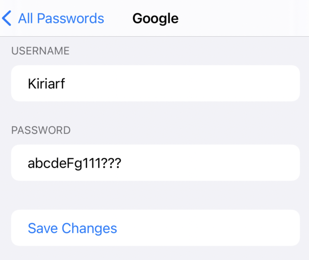

# kpass
kpass is a simple-to-use password manager app. I built it for two reasons:

1. To try native app development and Swift.

2. I don't like any of the existing password managers. I wanted to have something that I can use quickly and without an internet connection to ensure that my data is not going anywhere (except for Apple, in this case).

## Setup

1. [Install Xcode](https://apps.apple.com/us/app/xcode/id497799835?mt=12)  
2. While that is downloading (it's a big one), clone this repo.  
3. Open the repo with Xcode.  

### If You Have an iPhone with FaceID
1. Connect it to your computer and choose it as the simulator device.  

2. Build the project. 
3. Accept the FaceID request.  
4. Click Unlock Password and use FaceID.  

### If You Don't Have an iPhone with FaceID
1. Choose iPhone X or later.  

2. Build the project.  
3. Got to Feature > FaceID > Enrolled.  

4. Click Unlock Passwords button.  
5. Go to Features > FaceID > Matching Face.  

## How to Use

If you don't have any passwords, you will be greeted with this screen on the All Passwords page:

### Adding a Password

Go to the New Password tab, and fill in the form:

Note: the Add Password button will only show up once all the fields are not blank. You can also use the Show toggle to see what you're typing.

### Using Your Passwords

Once you have something saved, you can go back to the All Passwords tab, where you will find your list.

Tap on one of the items, and you will be taken to a detail screen:

On this screen, you have three buttons: 
1. The eye button will show or hide your password.  

2. The copy button will copy the password to your clipboard.   
3. The pencil button will take you to the Edit Password page.   

## Bugs
- All passwords page -> Title not showing 
- Padding in PasswordDetail wrong 
