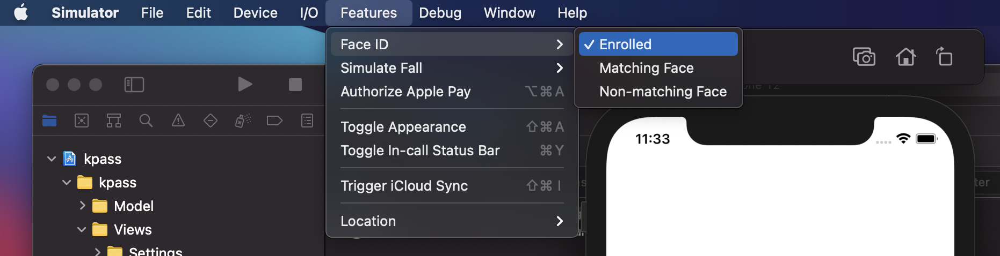

# kpass
kpass is a simple-to-use password manager app. I built it for two reasons:

1. To try native app development and Swift.

2. I don't like any of the existing password managers. I wanted to have something that I can use quickly and without an internet connection to ensure that my data is not going anywhere (except for Apple, in this case).

## Setup

1. [Install Xcode](https://apps.apple.com/us/app/xcode/id497799835?mt=12)  
2. While that is downloading (it's a big one), clone this repo.  
3. Open the repo with Xcode.  

### If You Have an iPhone with FaceID
1. Connect it to your computer and choose it as the simulator device.  

2. Build the project. 
3. Accept the FaceID request.  
4. Click Unlock Password and use FaceID.  

### If You Don't Have an iPhone with FaceID
1. Choose iPhone X or later.  

2. Build the project.  
3. Got to Feature > FaceID > Enrolled.  

4. Click Unlock Passwords button.  
5. Go to Features > FaceID > Matching Face.  

## How to Use

## Bugs
- All passwords page -> Title not showing 
- Padding in PasswordDetail wrong 
